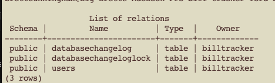

## 0.2.0 install docker

Docker on macOS is installed via Docker Desktop. The CLI (docker, docker compose) comes with it.

1. Download Docker Desktop

Go to:

https://www.docker.com/products/docker-desktop/

Click Download for Mac.

Important choice

Apple Silicon (M1/M2/M3) → choose Apple chip version

Intel Mac → choose Intel version

If you’re unsure:

Apple menu → About This Mac → Chip

2. Install Docker Desktop

Open the downloaded .dmg

Drag Docker.app into Applications

Open Docker.app from Applications

macOS will ask for:

  * Password
  * Permissions
  * Possibly “Allow system extensions”
    → approve everything

Docker must be running for the CLI to work.

Step 2: Verify Docker is running

Once Docker Desktop is open:

* You should see the whale icon in the macOS menu bar

* Status should say Docker is running

Now open a new terminal window (important) and run:
```
docker --version
```

You should see something like:
```
Docker version 26.x.x, build ...
```

Then:
```
docker compose version
```

You should see:
```
Docker Compose version v2.x.x
```

If both work, Docker is correctly installed.

## 0.2.1 Add Docker Compose for Postgres (local dev)

### add docker-compose.yml

```yaml
services:
  postgres:
    image: postgres:16-alpine
    container_name: bill-tracker-postgres
    environment:
      POSTGRES_DB: bill_tracker
      POSTGRES_USER: billtracker
      POSTGRES_PASSWORD: billtracker
    ports:
      - "5432:5432"
    healthcheck:
      test: ["CMD-SHELL", "pg_isready -U billtracker -d bill_tracker"]
      interval: 5s
      timeout: 3s
      retries: 20
    volumes:
      - postgres_data:/var/lib/postgresql/data

volumes:
  postgres_data:

```

run

```
docker compose up -d
docker ps
```

extra proof
```
docker exec -it bill-tracker-postgres psql -U billtracker -d bill_tracker -c "select 1;"

```

expected: a ```1``` result


## 0.2.2 Configure Spring Boot to use that Postgres

Why this matters

ddl-auto: validate forces the DB schema to be created by Liquibase, not Hibernate.

If you mess up a migration, the app fails fast instead of silently creating tables differently.

### application-local.properties

```properties
spring.datasource.url=jdbc:postgresql://localhost:5432/bill_tracker
spring.datasource.username=billtracker
spring.datasource.password=billtracker

spring.datasource.driver-class-name=org.postgresql.Driver

spring.jpa.database-platform=org.hibernate.dialect.PostgreSQLDialect
spring.jpa.hibernate.ddl-auto=validate

spring.liquibase.enabled=true


```

## 0.2.3 Create Liquibase changelog files

db/changelog/db.changelog-master.yaml

```yaml

databaseChangeLog:
  - include:
      file: db/changelog/changes/001-init.yaml

```

db/changelog/changes/001-init.yaml
This is Slice 0, so we keep it tiny, but real.
```yaml
databaseChangeLog:
  - changeSet:
      id: 001-init-users
      author: you
      changes:
        - createTable:
            tableName: users
            columns:
              - column:
                  name: id
                  type: uuid
                  constraints:
                    primaryKey: true
                    nullable: false
              - column:
                  name: email
                  type: varchar(255)
                  constraints:
                    nullable: false
                    unique: true
              - column:
                  name: created_at
                  type: timestamptz
                  constraints:
                    nullable: false
```
0.2.4 Run the app and confirm Liquibase ran

## run the app locally since you put the liqubase properties in application-local.properties

Now verify in the database (this is the “prove it” step):

```bash
docker exec -it bill-tracker-postgres psql -U billtracker -d bill_tracker -c "\dt"

```
Expected: tables including:

databasechangelog

databasechangeloglock

users

If you see those, Liquibase is correctly wired.




Note: later in Slice 1 we’ll add password hash, refresh token table, etc.

0.3 Integration test that proves Liquibase ran (TDD foundation)

```java
package com.yourorg;

import org.junit.jupiter.api.Test;
import org.springframework.boot.test.context.SpringBootTest;
import org.springframework.jdbc.core.JdbcTemplate;
import org.springframework.test.context.DynamicPropertyRegistry;
import org.springframework.test.context.DynamicPropertySource;
import org.testcontainers.containers.PostgreSQLContainer;
import org.testcontainers.junit.jupiter.Container;
import org.testcontainers.junit.jupiter.Testcontainers;

import static org.assertj.core.api.Assertions.assertThat;

@Testcontainers
@SpringBootTest
class LiquibaseSmokeIT {

  @Container
  static final PostgreSQLContainer<?> postgres =
      new PostgreSQLContainer<>("postgres:16-alpine")
          .withDatabaseName("testdb")
          .withUsername("test")
          .withPassword("test");

  @DynamicPropertySource
  static void props(DynamicPropertyRegistry r) {
    r.add("spring.datasource.url", postgres::getJdbcUrl);
    r.add("spring.datasource.username", postgres::getUsername);
    r.add("spring.datasource.password", postgres::getPassword);
    r.add("spring.jpa.hibernate.ddl-auto", () -> "validate");
  }

  @Test
  void liquibaseCreatesUsersTable(JdbcTemplate jdbc) {
    Integer exists = jdbc.queryForObject("""
      select count(*) from information_schema.tables
      where table_schema = 'public' and table_name = 'users'
    """, Integer.class);

    assertThat(exists).isEqualTo(1);
  }
}

```

# Liquibase Wrap-Up

Liquibase explanation: what it does and why we use master changelog
What Liquibase does (in plain terms)

Liquibase is your database version control system.

* You write change sets (create table, add column, index, etc.)

* Liquibase applies them to the database in order

* It records what ran in:

  * databasechangelog

  * databasechangeloglock

That’s why you see those tables in Postgres.

Why we do db.changelog-master

The master file is just the entry point.

Think of it like:

* main() in Java

* index.ts in a frontend app

It does not contain everything. It includes other files so we can keep changes organized:

* db.changelog-master.yaml

    * includes changes/001-init.yaml

    * later includes changes/002-auth.yaml

    * later includes changes/003-bills.yaml

This gives you:
* small PRs (each change file is focused)

* easier code review

* fewer merge conflicts

* predictable ordering

## What you will do moving forward with Liquibase
Whenever you need a schema change you will:
1) Create a new changeset file or add a new changeset to an existing “chapter” file.
   * Example: changes/002-auth.yaml includes users auth fields, refresh tokens table, indexes.

2) Give it:
   * a unique id
   * your name (author)

3) Add it to master changelog (if it is a new file)

4) Run locally:
   * ./gradlew bootRun OR ./gradlew test

5) Verify:
   * schema changes exist
   * databasechangelog shows it ran

Strong opinion: never edit old changeSets that ran on shared environments.
* If you need to change something, create a new changeSet that alters it.
* Otherwise you’ll break environments that already applied the old one.

Why we are doing this instead of letting Hibernate create tables
Hibernate auto-DDL is convenient, but for real teams it causes drift:
* local schema differs from CI
* CI differs from prod
* prod differs from “whatever Tony did last week”

Liquibase makes schema changes:
* explicit
* reviewable
* reproducible